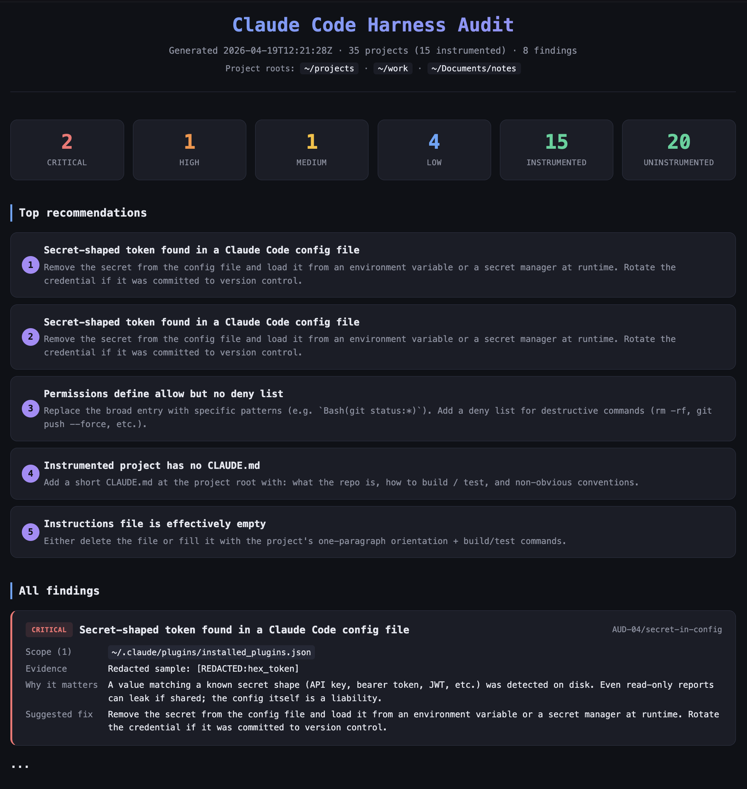

# harness-audit

**harness-audit** is a Claude Code plugin that scans every `.claude/` directory and `CLAUDE.md` on your machine and writes a single self-contained report — a beautiful HTML page or a functional Markdown file — showing what's configured, what's a security risk, and what to fix first. Install it, run it, open the file. Built for developers juggling many Claude Code projects.



## Install

Inside Claude Code, add the marketplace and install the plugin:

```
/plugin marketplace add vladzsh/harness-audit
/plugin install harness-audit@harness-audit
```

Local development — clone and point Claude Code at the directory:

```bash
git clone https://github.com/vladzsh/harness-audit.git
claude --plugin-dir ./harness-audit
```

No compile step. No pip install. Python 3.11+ (ships with macOS, widely available on Linux) is the only requirement.

## Usage

Invoke the skill from Claude Code:

```
/harness-audit:report
```

Or in natural language: _"audit my Claude Code setup"_. By default the skill writes an HTML report. Ask for Markdown instead:

```
/harness-audit:report markdown
```

The report lands at `~/.claude/harness-audit/report-<timestamp>.{html,md}`. Open the HTML in any browser — no server, no network.

Point at non-default project roots by invoking the underlying script directly:

```bash
python3 ~/.claude/plugins/harness-audit/skills/report/cli.py \
  --roots ~/projects --roots ~/rg --format markdown
```

## What it audits

| Area | Rule id | What it flags |
|------|---------|---------------|
| Secret leakage | `AUD-04/secret-in-config` | API keys, bearer tokens, JWTs, and other secret shapes in any config file |
| Suspicious hooks | `AUD-03/suspicious-hooks` | Remote `curl`/`wget`, `nc`, `eval`, `base64 -d \| bash`, pipe-to-shell |
| Over-broad permissions | `AUD-02/broad-permissions` | Blanket allow entries, allow-without-deny |
| Settings schema | `AUD-01/settings-schema` | Malformed JSON, unknown top-level keys, deprecated shapes |
| Missing recommended config | `AUD-06/missing-recommended` | Global without `CLAUDE.md`, MCP without settings, instrumented project without orientation doc |
| Instruction hygiene | `AUD-05/claude-md-hygiene` | `CLAUDE.md` / `AGENTS.md` that's too big, effectively empty, heading-less, or has duplicate headings |
| Best-practice gaps | `AUD-07/best-practice-gap` | Small curated set of plugins you probably want enabled |

Findings that appear in multiple projects collapse to one entry with a merged scope, so a shared misconfiguration shows up once — not thirty times.

## Safety

- **Read-only.** The tool only reads your harness. The only files it writes are the reports under `~/.claude/harness-audit/`.
- **Secrets redacted.** Tokens matching known shapes are replaced with `[REDACTED:<kind>]` markers before they can ever reach the report.
- **Paths normalized.** Absolute `$HOME` prefixes become `~` in both outputs, so reports are safe to share with teammates.
- **Self-contained output.** The HTML is a single file with inline CSS, zero external assets, no JavaScript — open it anywhere, even offline.

## Sample report

A sanitized sample lives at [`sample-report.html`](./sample-report.html) in this repo — clone or download the file and open it in a browser to preview the output (35 fictional projects, 8 findings across the four severity levels).

Default output path for real runs:

```
~/.claude/harness-audit/report-<timestamp>.html
~/.claude/harness-audit/report-<timestamp>.md
```

The HTML opens as a dark-themed dashboard: stat cards at the top (critical / high / medium / low counts), a top-5 action list, every finding rendered with evidence and a concrete fix, and a collapsible per-project drilldown at the bottom. The Markdown carries the same content in a plain, pipeable format.

## Project layout

```
harness-audit/
├── .claude-plugin/plugin.json        # plugin manifest
├── skills/report/
│   ├── SKILL.md                      # entry contract
│   ├── cli.py                        # discover → audit → render
│   ├── harness/                      # filesystem walker (read-only)
│   ├── audit/                        # Finding model, redaction, rules
│   └── render/                       # view-model + HTML + Markdown
├── LICENSE                           # MIT
└── README.md
```

All rules are deterministic — no LLM in the loop, no network calls, no flakiness.

## Status

v0.1.0 — first public release. Audits Claude Code harnesses only. OpenAI Codex, Gemini CLI, and OpenCode support is v2 territory.

## License

MIT — see [LICENSE](./LICENSE).
